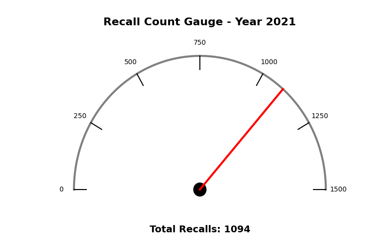

# Introduction
Want to know about vehicle recalls? 🚗 Check out the project below!

***Note, the [data comes from the National Highway Traffic Safety Administration](https://data.transportation.gov/Automobiles/NHTSA-Recalls-by-Manufacturer/mu99-t4jn?os=iosdffno_journeystrueO3jwaMES&ref=app) and was accessed on 09/12/2025.***

***Data includes recalls reported from 1966 up to September 12, 2025, which is when the data was retrieved.***

# Background
I love cars, all types. I love toy cars (I collect Hot Wheels! 🏎️), gas-powered vehicles, and EVs. So I looked for data regarding cars and found the recalls NHTSA's dataset.

Below are my findings from the dataset.

SQL queries? Check them out: [sql_project/queries](/sql_project/)
# Analysis

### Which year had the highest number of recalls?

Our analysis started by asking: Which year had the most recalls from 1966 to 2025 so far? 

```
SELECT year_report_received, total_recalls
FROM 
    (SELECT year_report_received, COUNT(*) AS total_recalls
    FROM recall_nhtsa
    GROUP BY year_report_received) 
    AS second_count
WHERE total_recalls = 
    (SELECT MAX(total_recalls)
FROM 
    (SELECT COUNT(*) AS total_recalls
    FROM recall_nhtsa
    GROUP BY year_report_received)  
    AS first_count);
```
After querying for the year, the result was 2021 with 1094 recalls. 



Now, lets look at the other end of the spectrum.

### Which year had the lowest number of recalls?

Let's look at the dataset.
```
SELECT year_report_received, total_recalls
FROM (
    SELECT year_report_received, COUNT(*) AS total_recalls
    FROM recall_nhtsa
    GROUP BY year_report_received
) AS second_count
WHERE total_recalls = (
    SELECT MIN(total_recalls)
    FROM (
        SELECT COUNT(*) AS total_recalls
        FROM recall_nhtsa
        GROUP BY year_report_received) AS first_count);
```
After the query, we notice that 1966 had 58 recalls, which is the lowest.


Okay, the years are now covered. So, let's look into the decades from 1966 to 2025.

### Which decade had the most recalls?

After diving into this query with some beep-bop-booping 😁, the result was the 2010s with 8511 recalls.

```
SELECT decade, total_recalls
FROM (SELECT (year_report_received / 10) * 10 AS decade, COUNT(*) AS total_recalls
      FROM recall_nhtsa
      GROUP BY (year_report_received / 10) * 10)
      AS second_count
WHERE total_recalls =
      (SElECT MAX(total_recalls)
        FROM 
        (SELECT COUNT(*) AS total_recalls
         FROM recall_nhtsa
         GROUP BY (year_report_received / 10) * 10)
      AS first_count);
```

Look athe visualization ↓


Want to know abou the decade with the least amount of recalls? Check it out below.

### Which decade had the lowest number of recalls?

Well, the answer turns out to be the 1960s with 525 recalls.

```
SELECT decade, total_recalls
FROM (SELECT (year_report_received / 10) * 10 AS decade, COUNT(*) AS total_recalls
      FROM recall_nhtsa
      GROUP BY (year_report_received / 10) * 10)
      AS second_count
WHERE total_recalls =
      (SELECT MIN(total_recalls)
        FROM 
        (SELECT COUNT(*) AS total_recalls
         FROM recall_nhtsa
         GROUP BY (year_report_received / 10) * 10)
      AS first_count);
```
Visual:


Alright, decades and years have been covered. So, what should be analyzed next? The answer is brands!

### Which brand had the most recalls from 1966 to 2025?

Turns out it is General Motors with a total of 1688 recalls.

```
SELECT Manufacturer, total_recalls
FROM (
    SELECT manufacturer, COUNT(*) AS total_recalls
    FROM recall_nhtsa
    GROUP BY manufacturer
    ) 
    AS second_count
WHERE total_recalls = 
    (
     SELECT MAX(total_recalls)
     FROM 
     (
        SELECT COUNT(*) AS total_recalls
        FROM recall_nhtsa
        GROUP BY manufacturer
     ) 
        AS first_count
     );
```
Visual:


Okay, let's look at the brand with the least amount of recalls.

### Which brand had the lowest number of recalls?

This answer would be different than the previous as many brands came up. To make things simpler, I added a LIMIT of 10 to the query.

```
SELECT Manufacturer, total_recalls
FROM (
    SELECT manufacturer, COUNT(*) AS total_recalls
    FROM recall_nhtsa
    GROUP BY manufacturer
    ) 
    AS second_count
WHERE total_recalls = 
    (
     SELECT MIN(total_recalls)
     FROM 
     (
        SELECT COUNT(*) AS total_recalls
        FROM recall_nhtsa
        GROUP BY manufacturer
     ) 
        AS first_count
     )
ORDER BY manufacturer ASC
LIMIT 10;
```
Visual:


All the brands displayed abovve had a total recall of 1. And these brands range from A. D. MILLER to 3M Transportation Safety Division.

Thought we were done with the analysis? No! There's more to be explored.

### How do Porsche, BMW, and Mercedes-Benz stack up?

As mentioned before, I love cars. I especially love german cars (Hope to one day own a Porsche 911 🚙💨). So, why not compare them?

So, I did exctly that:

```
SELECT manufacturer, COUNT(*) AS total_recalls
FROM recall_nhtsa
WHERE manufacturer LIKE '%Porsche%' OR 
      manufacturer LIKE '%Audi%' OR 
      manufacturer LIKE '%BMW%' OR
      manufacturer LIKE '%Mercedes%'
GROUP BY manufacturer
ORDER BY total_recalls DESC;
```
*Searched for Audi, but nothing came up.*

And now the visual:


Maybe I should stick to Porsche cars. But it never hurts to drive a Mercedes-Benz GT ! 😀

# Conclusion

Well, this marks the end of the analysis journey. We can conclude that cars are safer now than before. The recalls being the highest in the 2010s means that the car industry is better at catching and fixing defects. And driving a Porsche is better than not driving one.